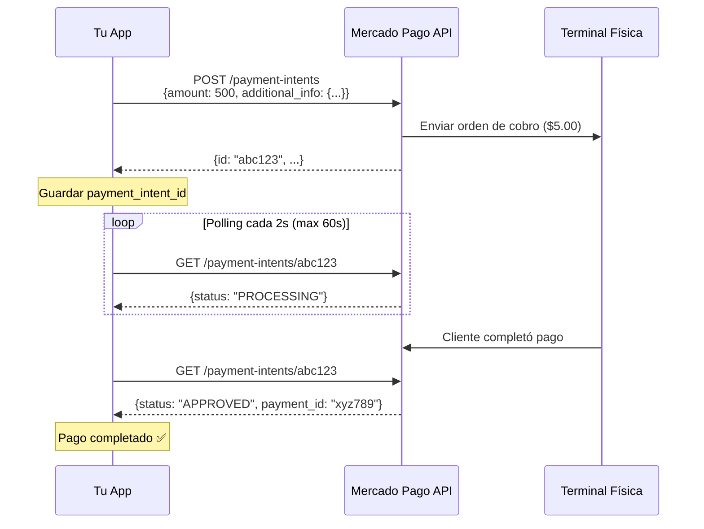

# 📝 Formato Correcto del Payload para Mercado Pago Point

## ❌ Problema Detectado

El payload inicial tenía propiedades que la API de Mercado Pago Point **NO acepta**:

```javascript
// ❌ INCORRECTO - Causaba error 400
{
  amount: 1.00,
  description: "Orden 12345",           // ❌ No permitido
  external_reference: "order-123",      // ❌ No permitido aquí
  payment: {                             // ❌ No permitido
    installments: 1,
    type: 'credit_card'
  },
  additional_info: {
    external_reference: "order-123",
    print_on_terminal: true
  }
}
```

**Error recibido:**
```
400 Bad Request
Additional property description is not allowed
Additional property external_reference is not allowed
Additional property payment is not allowed
```

---

## ✅ Solución: Payload Correcto

Según la [documentación oficial de Mercado Pago](https://www.mercadopago.com.mx/developers/es/reference/point_apis_mlm/_point_integration-api_devices_deviceid_payment-intents/post):

```javascript
// ✅ CORRECTO
{
  amount: 500,                    // Monto en centavos (500 = $5.00 MXN) - MÍNIMO: 500
  additional_info: {
    external_reference: "order-123",  // Referencia externa va AQUÍ
    print_on_terminal: true           // Si quieres imprimir ticket
  }
}
```

### ⚠️ **IMPORTANTE: Monto Mínimo**

**Mercado Pago Point requiere un monto mínimo de $5.00 MXN (500 centavos)**

- ✅ Monto mínimo: `amount: 500` ($5.00 MXN)
- ❌ Monto menor a 500 será rechazado con error 400

### Campos Obligatorios

| Campo | Tipo | Descripción | Ejemplo | Restricciones |
|-------|------|-------------|---------|---------------|
| `amount` | `integer` | Monto en **centavos** (sin decimales) | `1500` = $15.00 MXN | **Mínimo: 500** ($5.00) |
| `additional_info` | `object` | Información adicional | Ver abajo | Requerido |

### Campos de `additional_info`

| Campo | Tipo | Obligatorio | Descripción |
|-------|------|-------------|-------------|
| `external_reference` | `string` | ✅ Sí | ID de tu orden/transacción |
| `print_on_terminal` | `boolean` | ⚪ Opcional | `true` para imprimir ticket en terminal |

---

## 💡 Importante: Conversión de Montos

### **El monto DEBE estar en centavos (sin decimales)**

```javascript
// Conversión correcta
const amountInPesos = 15.75;                    // $15.75 MXN
const amountInCentavos = Math.round(15.75 * 100); // 1575 centavos

const payload = {
  amount: 1575,  // ✅ Correcto
  additional_info: {
    external_reference: "order-456",
    print_on_terminal: true
  }
};
```

### Ejemplos de Conversión

| Pesos MXN | Centavos | Valor en Payload | ¿Válido? |
|-----------|----------|------------------|----------|
| $1.00 | 100 | `amount: 100` | ❌ Menor al mínimo |
| $4.99 | 499 | `amount: 499` | ❌ Menor al mínimo |
| **$5.00** | **500** | **`amount: 500`** | ✅ **Mínimo permitido** |
| $10.50 | 1050 | `amount: 1050` | ✅ Válido |
| $99.99 | 9999 | `amount: 9999` | ✅ Válido |
| $1,234.56 | 123456 | `amount: 123456` | ✅ Válido |

---

## 📤 Ejemplo de Request Completo

```bash
curl -X POST \
  'https://api.mercadopago.com/point/integration-api/devices/NEWLAND_N950__N950NCC303060763/payment-intents' \
  -H 'Content-Type: application/json' \
  -H 'Authorization: Bearer YOUR_ACCESS_TOKEN' \
  -d '{
    "amount": 500,
    "additional_info": {
      "external_reference": "order-12345",
      "print_on_terminal": true
    }
  }'
```

---

## 📥 Respuesta Esperada

```javascript
{
  "id": "7f25f9aa-eea6-4f9c-bf16-a341f71ba2f1",           // ID de la intención de pago
  "device_id": "NEWLAND_N950__N950NCC303060763",          // ID del dispositivo
  "amount": 500,                                          // Monto en centavos ($5.00)
  "additional_info": {
    "external_reference": "order-12345",
    "print_on_terminal": true
  }
}
```

### Campos de la Respuesta

| Campo | Tipo | Descripción |
|-------|------|-------------|
| `id` | `string` | ID único de la intención de pago (usar para consultar estado) |
| `device_id` | `string` | ID del dispositivo al que se asignó |
| `amount` | `integer` | Monto en centavos |
| `additional_info` | `object` | Información adicional que enviaste |

---

## 🔄 Flujo Completo del Pago



---

## 🛠️ Cambios Realizados en el Código

### `mercadoPagoService.ts`

**ANTES:**
```typescript
const payload = {
  amount: request.amount,
  description: request.description,
  external_reference: request.externalReference,
  payment: {
    installments: 1,
    type: 'credit_card'
  },
  additional_info: {
    external_reference: request.externalReference,
    print_on_terminal: true
  }
};
```

**DESPUÉS:**
```typescript
const payload = {
  amount: Math.round(request.amount * 100), // Convertir a centavos
  additional_info: {
    external_reference: request.externalReference,
    print_on_terminal: true
  }
};
```

---

## ⚠️ Notas Importantes

1. **Monto mínimo: $5.00 MXN**: La API rechazará cualquier monto menor a 500 centavos
2. **Monto siempre en centavos**: No envíes decimales, la API los rechaza
3. **Solo 2 propiedades raíz**: `amount` y `additional_info`
4. **external_reference va en additional_info**: No en la raíz
5. **No envíes description**: La API no lo acepta
6. **No envíes payment object**: La terminal maneja el método de pago
7. **Status inicial siempre es PENDING**: Debes hacer polling para obtener el resultado

---

## 🔗 Referencias

- [Documentación Oficial - Crear Intención de Pago](https://www.mercadopago.com.mx/developers/es/reference/point_apis_mlm/_point_integration-api_devices_deviceid_payment-intents/post)
- [Documentación - Consultar Estado de Pago](https://www.mercadopago.com.mx/developers/es/reference/point_apis_mlm/_point_integration-api_payment-intents_paymentintentid/get)
- [Guía de Integración Point API](https://www.mercadopago.com.mx/developers/es/docs/mp-point/integration-api)

---

✅ **Con estos cambios, el payload ahora es compatible con la API de Mercado Pago Point**
